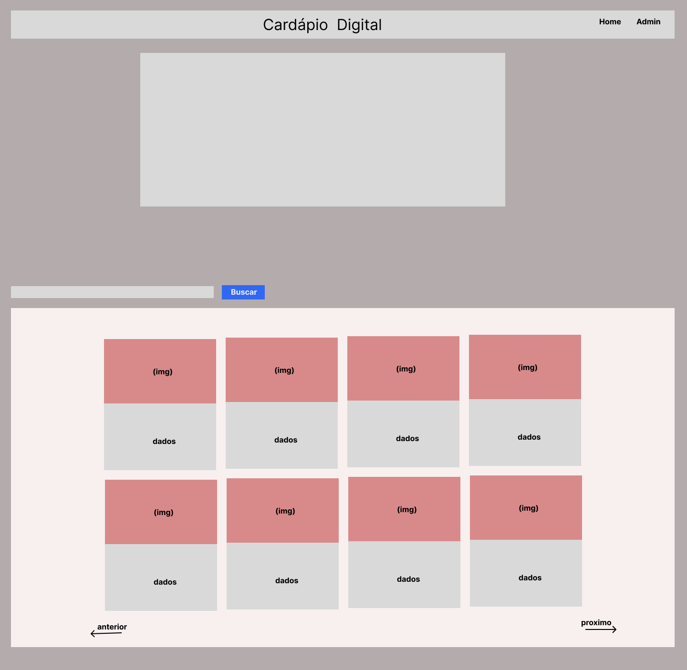
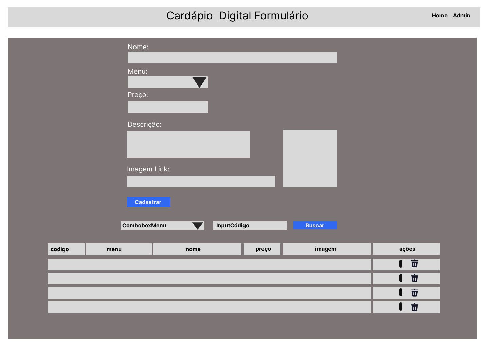
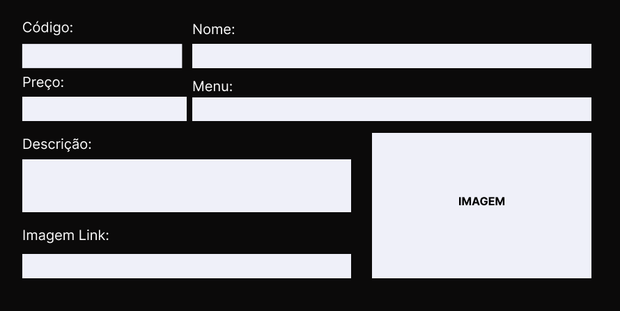
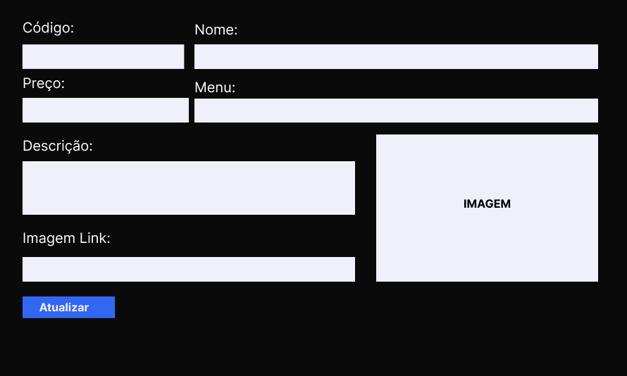

# UC- SISTEMA  DE CARDAPIO

É um sistema para cadastrar alimentos sendo divididos por seus tipos como lanche, almoço e sobremesa. E poder gerenciar estes alimentos e assim facilitar a escolha do que o cliente vai querer degustar podendo escolher no seu cardápio digital.

**Tela de Home:**

**Regra de Negócio:**

​	**RN-001** -> Clicando no botão "Home" o sistema direciona para a tela inicial do home.

​	**RN-002** -> Clicando no botão Admin o sistema direciona para a  tela "Cardapio Digital Formulário".  

​	**RN-003** -> Abaixo do cabeçalho "Cardapio Digital" vai ter um carrossel com imagens (que vai ser definida pelo cliente).

​	**RN-004** -> Abaixo do carrossel vai ter um formulário para poder permitir que o usuário faça um filtro pelo tipo de menu. Exemplo (Lanche, Almoço, Sobremesa).

​	**RN-005** -> Abaixo o sistema já vai carregar todos os alimentos por paginação, podendo ser filtrados pela **RN-004** onde só vai carregar os dados pelo tipo do menu. E vai ser carregados em cardes.

​	**RN-006** -> O Carde vai conter as seguintes informações, imagem do alimento e os dados que são (nome, descrição, preço).

​        **RN-007** -> Os botões anterior e próximo vai carregar os dados do banco de 10 em 10. e o botão anterior só vai aparecer quando a paginação sair do 0. 

​	**RN-008** -> Botão "**Admin**" quando ele for clicado o sistema vai direcionar para a página de "Cardapio Digital Formulário".

**Tela de Cardapio Digital Formulário:**

​	**RN009** -> "**Botão Cadastrar**"  quando clicar no botão adicionar, o sistema vai salvar os valores dos campos, (menu, nome, preço, link da imagem, descrição).

​	**RN010** -> **"Combobox Menu"** O usuário vai selecionar a opção do menu.

​	**RN011** -> **"input código"**  O usuário vai digitar o código do alimento.

​	**RN012** -> **"botão Buscar"**  Quando o botão for clicado, o sistema vai fazer a busca das informações ou pelo botão **"Combobox Menu"** da **RN002** ou pelo **"input código"**  e vai exibir o resultado da busca em uma tabela.

​	**RN013** -> **"Tabela"** a tabela vai ter como cabeçalho (código, menu, nome, preço, imagem, descrição, ações), e a tabela vai ser preenchida de acordo com a **RN012**. 

​	**RN014** ->  **"Botão excluir"** que fica dentro do campo **ações** da tabela, ao ser clicado ele vai exibir uma mensagem deseja realmente excluir se for sim o sistema exclui se não fecha-se a mensagem.

​	**RN015** -> Caso o usuário clique na linha da tabela **"nome"** vai abrir um modal com as informações para poder visualizar todos os dados, não vai poder edita-lós.

​	**RN014** -> **"Modal-visualizar"** o modal vai trazer os campos (código, menu, nome, preço, imagem, descrição) já preenchidos, com todos os campos desabilitado. 

**Tela Modal-visualizar:**

​	**RN015** -> Botão **"editar"** quando for clicado o sistema vai abrir o modal com o campo código desabilitado e todos os outros campos habilitados para edição.

**Tela botão Editar:**

**Tabela de dados:**

**tbl_cardapio:**

| Nome do campo | Tipo de dados | Tamanho | Campo obrigatório | Unicidade | Editável |
| :-----------: | :-----------: | :-----: | :---------------: | :-------: | :------: |
|    código     |   PK (Long)   |    -    |        SIM        |    SIM    |    -     |
|     menu      |     ENUM      |    -    |        SIM        |     -     |    -     |
|     preço     |    DOUBLE     |    -    |        SIM        |     -     |   SIM    |
|    imagem     |    VARCHAR    |    -    |        SIM        |     -     |   SIM    |
|     nome      |    VARCHAR    |    -    |        SIM        |    SIM    |   SIM    |
|   descrição   |     TEXT      |    -    |        SIM        |     -     |   SIM    |

